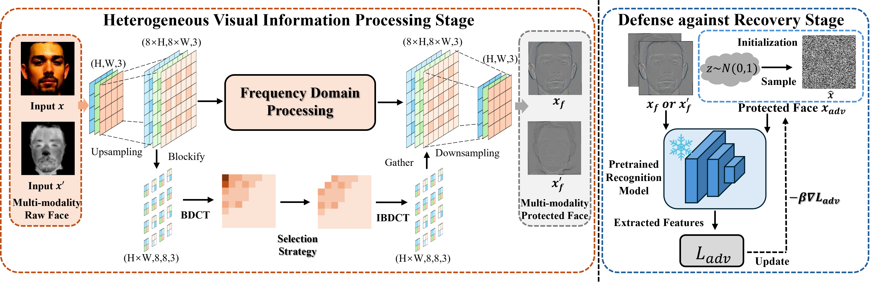

# PrivacyHFR: Visual Privacy Preserving for Heterogeneous Face Recognition

This repo contains the source code for our work **PrivacyHFR: Visual Privacy Preserving for Heterogeneous Face Recognition**. In the following is an instruction to use the code to train and evaluate our model.



## Dependencies

* Anaconda3 (Python 3.9, with Numpy etc.)
* Pytorch 1.12.1

## Datasets

[LAMP-HQ dataset](https://arxiv.org/abs/1912.07809) is a large-scale NIR-VIS face database with **56,788** NIR and **16,828** VIS images of **573** subjects. 

For each fold, the training set consists of almost 50% images from **300** subjects in the database. For the testing set, we select the rest **273** subjects, each with one VIS image and about **100** NIR images.


[CASIA NIR-VIS 2.0 dataset](https://ieeexplore.ieee.org/document/6595898) is widely used NIR-VIS face  dataset. This dataset contains **725** subjects. 

For each fold, the training set consists of about 6100 NIR images and **2500** VIS images from **360** identities. The test set consists of more than **6000** NIR and **358** VIS images from **358** identities, which are excluded from the training set.

[Tufts Face dataset](https://ieeexplore.ieee.org/document/8554155) is a large-scale public heterogeneous face database.

For the convenience of comparison, we choose the Thermal-VIS dataset, which contains **1583** paired thermal-VIS images from **112** subjects. we randomly select **90** subjects as the training set, the rest pairs are the testing set.

## Usage

### Prepare Database

1.Download face dataset such as CASIA NIR-VIS 2.0, LAMP-HQ and Tufts Face to the `./datasets` folder.

2.You can use RetinaFace for face detection and alignment, then crop face images to **128*128**. For more information, please refer to: https://github.com/serengil/retinaface.

3.Download the pre-trained weights for the LightCNN-29v4 model. You can obtain the model from: https://github.com/AlfredXiangWu/LightCNN.

### Run the code

Please enter the main folder, and run:
```bash
OMP_NUM_THREADS=16 torchrun --nproc_per_node 2 hvi.py --c ./config/Tufts
```

Then, you can modify the `WEIGHTS` in the `./config/Tufts.yml` file to specify a suitable model weight (the checkpoint file is saved in `./logs/Tufts`) to obtain the DRA images under that weight by running the code:
```bash
OMP_NUM_THREADS=16 torchrun --nproc_per_node 2 dra.py --c ./config/Tufts
```

Finally, you can value the model by running the code:
```bash
OMP_NUM_THREADS=16 torchrun --nproc_per_node 2 val_auc.py
```

## Main results

LAMP-HQ:
|   Model | Rank-1 | VR@FAR=1%   | VR@FAR=0.1%| VR@FAR=0.01% | 
| :------- | :---: | :---: |:---: | :---: | 
| InstaHide |  74.7% | 82.0% | 53.4% | 27.5% |
| DCTDP | 85.4% |    93.5%    |    74.7%  |    45.6%  | 
| AVIH | 92.6% |    95.4%    |    75.2%  |    47.2%  | 
| Ours | 99.0% |    99.3%    |    98.7%  |    93.9%  |

CASIA NIR-VIS 2.0:
|   Model | Rank-1 | VR@FAR=1%   | VR@FAR=0.1%|
| :------- | :---: | :---: |:---: |
| InstaHide |  25.4% | 31.2% | 11.5% |
| DCTDP | 62.9% |    78.1%    |    53.5%  |
| AVIH | 99.0% |    99.9%    |    97.9%  |
| Ours | 99.4% |    99.9%    |    99.2%  |

Tufts Face:
|   Model |  AUC | EER  | VR@FAR=1%|
| :------- | :---: | :---: |:---: | 
| InstaHide | 10.7% | 73.5% | 32.8% |
| DCTDP |23.4% |    88.7%    |  19.5%  |  
| AVIH | 38.0% |    94.0%    |    13.4%  |
| Ours |82.8% |    99.2%    |    4.2%  |

You can download pre-trained model weights from [google drive](https://drive.google.com/drive/folders/1_94RAb_ur8yvEUSOviY0J7ts4fZVIU5o?usp=sharing).

## References

[LightCNN](https://github.com/AlfredXiangWu/LightCNN)，
[RetinaFace](https://github.com/serengil/retinaface).
[MAMCO-HFR](https://github.com/xiyin11/Semi-HFR).